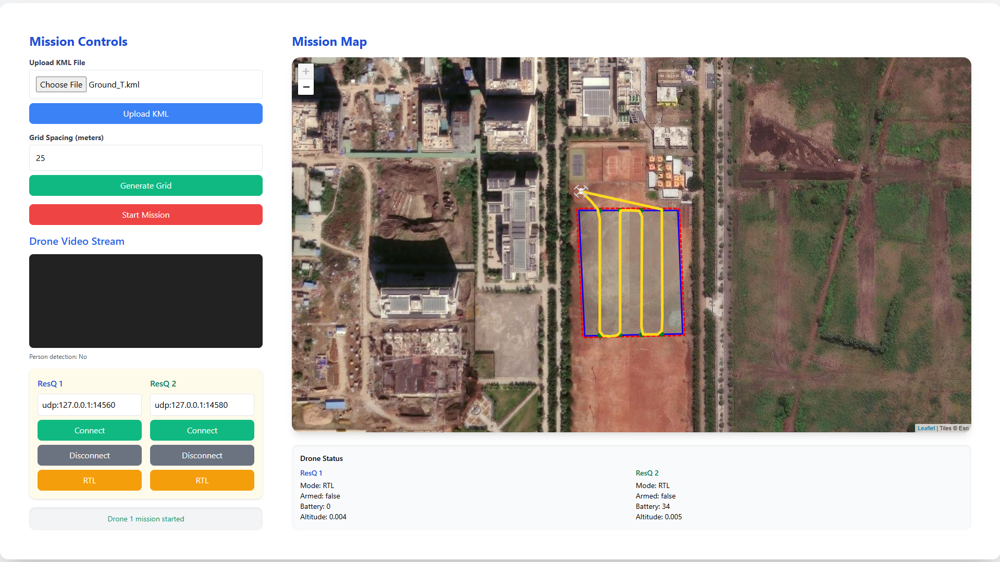
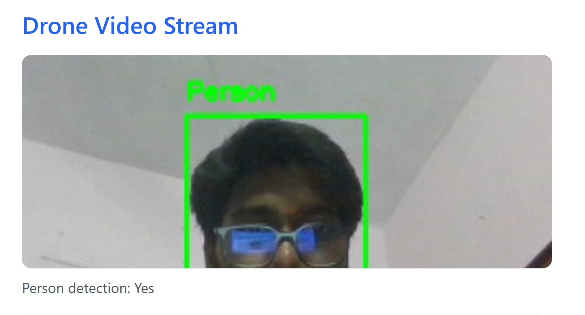
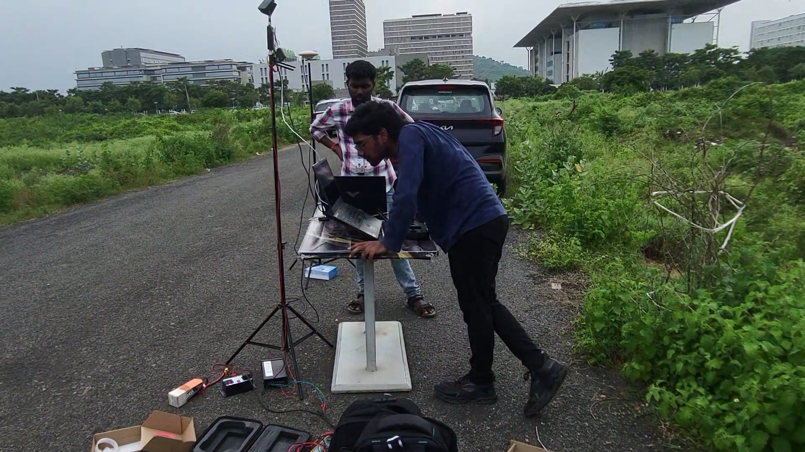

# NIADR — Autonomous Drone-Based Disaster Response System

## Project Overview

NIADR is an advanced, fully autonomous two-drone system designed for real-time search-and-rescue (SAR) and automated humanitarian aid delivery in disaster zones. Operating without manual pilot intervention, the system coordinates two distinct aerial vehicles to perform search and rescue operations:

*   **Drone 1 (Mapping and Detection):** Conducts high-altitude area surveys, running real-time AI-based person detection on aerial camera feeds. It geometrically projects image coordinates to precise real-world GPS coordinates and logs survivor locations.
*   **Drone 2 (Search and Rescue):** Dynamically consumes localized telemetry data from the mapping drone, plans optimal routes to survivors, descends to low altitudes, and deploys humanitarian aid packages using a servo-triggered drop mechanism.

The entire orchestration is managed by a lightweight Flask REST API, offering real-time monitoring and mission configuration via an interactive web interface.

---

## Key Features

*   **Fully Autonomous Two-Drone Coordination:** Decentralized coordination where the mapping and rescue drones share status and location logs to automate search-and-deliver operations without human in the loop.
*   **Real-Time Aerial AI Detection:** Integrates a custom-trained YOLOv8-based model (trained on aerial search datasets) optimized for person detection from high altitudes.
*   **Camera Lens Distortion Correction:** Uses pre-calculated camera intrinsic matrices ($K$) and lens distortion coefficients to rectify live and batch-processed camera feeds for pixel-accurate target calculations.
*   **Downward-Pointing Geolocation Pipeline:** Features a custom geometric projection algorithm that converts bounding-box screen coordinates to absolute real-world GPS coordinates using drone altitude, yaw, and camera intrinsic calibration.
*   **Servo-Triggered Aid Kit Drop:** Programmatically controls hardware servos over MAVLink using custom PWM configurations to deploy emergency survival payloads.
*   **Geofence-Based Mission Planning:** Supports polygon-based geofences uploaded via KML, automatically generating grid waypoints for maximum search area coverage while enforcing strict virtual boundaries with automated Return-to-Launch (RTL) safety overrides.
*   **Web Dashboard & Centralized REST API:** A responsive interface showing live drone status, mission planning grids, and video feeds, backed by a thread-safe Flask REST API.
*   **Duplicate-Safe Logging:** Logging pipeline with thread locks and distance-based duplicate suppression to ensure survivors are not repeatedly logged or visited.

---

## System Architecture

```
                                  [ KML Search Area ]
                                           │
                                           ▼
                                 [ Flask Web Dashboard ]
                                           │
                        ┌──────────────────┴──────────────────┐
                        ▼                                     ▼
             [ Drone 1: Mapping ]                   [ Drone 2: Rescue ]
              Altitude: 30m                          Altitude: 15m -> 2m
         ┌──────────────┴──────────────┐             ┌────────┴────────┐
         ▼                             ▼             ▼                 ▼
   [ Live RTSP Feed ]             [ Geofence ]  [ Read GPS Logs ] [ Servo Drop ]
         │                             │             │                 │
         ▼                             ▼             ▼                 ▼
   [ YOLOv8 Inference ]           [ Auto RTL ]  [ Navigate to ]   [ Deliver Aid ]
         │                                      [ Nearest Target ]
         ▼
   [ Camera Rectification ]
         │
         ▼
   [ Pixel-to-GPS Projection ]
         │
         ▼
   [ Log survivor to CSV ] ──────────────────────────┘
```

### Drone 1: Mapping and Detection Drone
*   **Mission Profile:** Launches and ascends to a stable surveying altitude of 30 meters. It executes an automated grid pattern across the search area defined by a polygon KML file.
*   **Vision & Geolocation Pipeline:** Processes an RTSP camera stream using OpenCV. Each frame is undistorted using the camera matrix ($K$) and distortion coefficients. When the YOLOv8 model detects a person, the system converts the centroid of the bounding box $(u, v)$ to real-world latitude and longitude using a haversine-based projection. This calculations incorporates:
    *   Current drone GPS coordinates (Latitude, Longitude)
    *   Relative drone altitude ($h$)
    *   Drone heading angle (Yaw, correcting for camera rotation)
    *   Lens focal length and principal points from camera calibration.
*   **Data Logging:** Logs confirmed detections to `drone_logs.csv` utilizing thread-safe logging mechanisms. A local distance threshold suppresses duplicate detections of the same survivor.

### Drone 2: Rescue and Payload Delivery Drone
*   **Mission Profile:** Initiates takeoff and ascends to a cruising altitude of 15 meters when the logged survivor count meets or exceeds the configured threshold.
*   **Path Planning & Navigation:** Continually reads coordinates from `drone_logs.csv`. It calculates the distance from its current position to all active survivor coordinates using the Haversine formula, selecting the nearest target for execution.
*   **Delivery Sequence:**
    1.  Navigates autonomously to the target coordinates.
    2.  Slowing down on approach, it hovers directly over the target.
    3.  Descends to a safe package-release altitude of 2 meters.
    4.  Issues a MAVLink command (`MAV_CMD_DO_SET_SERVO`) to activate a servo-controlled release mechanism (Channel 5), shifting the PWM to 2000µs for a 5-second duration before resetting to 1000µs.
    5.  Ascends back to 15 meters cruising altitude.
    6.  Removes the resolved target from `drone_logs.csv`, logs the completion to `drone_visited.csv`, and proceeds to the next target.
    7.  Initiates Return-to-Launch (RTL) when all targets are visited and Drone 1 finishes its survey.

---

## Tech Stack

*   **Programming Language:** Python 3.8+
*   **Deep Learning Framework:** PyTorch & Ultralytics YOLOv8 (Inference on CPU/CUDA)
*   **Computer Vision:** OpenCV (cv2), NumPy, Pillow
*   **Drone Interface:** DroneKit, MAVLink, pymavlink
*   **Web Services & API:** Flask, Flask-CORS, Werkzeug, Leaflet.js, Tailwind CSS
*   **Geospatial Processing:** Shapely (Polygon, Point, LineString calculations), NumPy

---

## System Media & Demonstrations

### Project Demo Video
Watch the full mission demonstration video showing two-drone autonomous coordination, real-time person detection, geofencing, and automated package delivery.

<video src="static/NIDAR_DEMO.mp4" controls width="100%"></video>

*If the video player does not load, you can download or play the file directly: [NIDAR Demo Video](static/NIDAR_DEMO.mp4).*

### 1. Web UI & Mission Planner Dashboard


### 2. YOLOv8 Real-Time Detection Feed


### 3. Hardware / Simulation Environment Setup


---

## File Structure

```
NIADR/
│
├── Nid.py                     # Main Flask backend (coordinates missions, REST API, YOLO thread, MAVLink interface)
├── coor.py                    # Standalone pipeline for offline/batch image and telemetry GPS processing
├── best.pt                    # Custom trained YOLOv8 model weights for high-altitude person detection
├── requirements.txt           # Python library dependencies
│
├── templates/
│   └── index.html             # HTML dashboard template featuring interactive maps and drone status widgets
│
├── static/
│   ├── tailwind.min.css       # Tailwind CSS styles for UI layout
│   ├── D.png                  # Drone 1 icon for map rendering
│   ├── D2.png                 # Drone 2 icon for map rendering
│   ├── person.png             # Survivor marker icon
│   ├── NIDAR_DEMO.mp4                 # Project mission demonstration video
│   ├── mission_planner_screenshot.png # Web UI mission planning dashboard screenshot
│   ├── yolov8_detection_feed.png      # YOLOv8 live person detection feed screenshot
│   └── system_setup.png               # Hardware/simulation environment setup photo
│
├── uploads/                   # Target directory for uploaded KML polygon files
├── person_images/             # Saved cropped/full images of detected survivors and associated telemetry JSON files
├── drone_logs.csv             # Centralized thread-safe CSV log tracking survivor GPS locations
└── drone_visited.csv          # Log tracking resolved survivor locations visited by Drone 2
```

---

## Installation & Requirements

### Prerequisites

*   Python 3.8 to 3.10 (Note: DroneKit requires Python < 3.11 unless modified).
*   ArduPilot SITL (Software In The Loop) or physical Pixhawk flight controllers running ArduCopter firmware.
*   QGroundControl or Mission Planner (for configuring simulation or monitoring vehicle status).
*   An active RTSP camera feed (e.g., `rtsp://192.168.144.25:8554/main.264`) or a USB camera.

### Step-by-Step Installation

1.  **Clone the Repository:**
    ```bash
    git clone https://github.com/yourusername/NIADR.git
    cd NIADR
    ```

2.  **Create a Virtual Environment:**
    ```bash
    python -m venv venv
    # Activate on Windows:
    venv\Scripts\activate
    # Activate on Linux/macOS:
    source venv/bin/activate
    ```

3.  **Install Required Dependencies:**
    ```bash
    pip install -r requirements.txt
    ```

4.  **Download YOLOv8 Weights:**
    Ensure your custom-trained YOLOv8 weights are saved in the project root directory under the filename `best.pt`.

---

## Camera Calibration Note

The geolocation accuracy of the system depends heavily on camera lens calibration. Rectification removes lens distortion (pin-cushion or barrel distortion) before pixel coordinate extraction.

### Calibration Parameters ($K$ and $Dist$)
The calibration matrix $K$ and distortion coefficients vector `dist` are hardcoded in `Nid.py` and `coor.py` based on a chessboard calibration routine.

**Nid.py Calibration Matrix ($K$):**
```python
K = np.array([
    [1870.39, 0, 811.36],
    [0, 1860.41, 521.88],
    [0, 0, 1]
])
```

**coor.py Calibration Matrix ($K$) and Distortion Coefficients (`dist`):**
```python
K = np.array([
    [1466.75124, 0, 434.400604],
    [0, 1443.50616, 362.768062],
    [0, 0, 1]
])
dist = np.array([-0.690061703, 3.10678069, 0.00428299, 0.0273968, -9.87146169])
```

If you change the camera module or capture resolution (default configured to $1280 \times 720$ and calibrated at $1920 \times 1080$), you must run a standard OpenCV camera calibration script and update these matrices to maintain coordinate accuracy.

---

## API Endpoints Table

The Flask server (`Nid.py`) exposes several REST API endpoints for drone telemetry, mission sequencing, and coordination.

| Endpoint | Method | Payload / Parameters | Description |
| :--- | :--- | :--- | :--- |
| `/` | GET | None | Renders the primary Leaflet.js-based web interface. |
| `/connect-drone` | POST | `{"drone_id": 1, "connection_string": "127.0.0.1:5760"}` | Establishes connection to Drone 1 or Drone 2 via MAVLink. |
| `/disconnect-drone`| POST | `{"drone_id": 1}` | Safely closes MAVLink connections and resets status structures. |
| `/upload-kml` | POST | Form-data: File (`.kml`) | Parses a polygon from KML, calculates a 2-meter outward geofence boundary. |
| `/generate-grid` | POST | `{"spacing": 10, "home": [lat, lon]}` | Generates parallel grid search waypoints with home-point reordering. |
| `/start-mission` | POST | `{"grid": [[lat, lon], ...]}` | Arms, takes off, and initiates the automated search mission for Drone 1. |
| `/start-drone2-mission`| POST | None | Manually triggers Drone 2 to launch and execute the rescue coordinate queue. |
| `/trigger-rtl` | POST | `{"drone_id": 1}` | Overrides current mission status and commands the target drone to Return to Launch. |
| `/set-speed` | POST | `{"drone_id": 1, "speed": 6.5}` | Updates cruising speeds (in m/s) on the vehicle and in configuration. |
| `/set-altitude` | POST | `{"drone_id": 2, "altitude_type": "default", "altitude": 15}` | Updates drone altitudes (`default`, `lowered`, or `rtl`). |
| `/set-home` | POST | `{"lat": float, "lon": float}` | Overrides the global mission home coordinates. |
| `/drone-status` | GET | None | Retrieves live telemetry (Armed state, Mode, GPS, Battery, Alt, Detections). |
| `/person-detected` | POST | None | Simulates/Triggers immediate hover and servo drop sequence on Drone 1. |
| `/person-locations`| GET | None | Reads and returns all detected survivor locations from `drone_logs.csv`. |
| `/video_feed` | GET | None | Streams the MJPEG video stream with YOLOv8 person detection overlays. |

---

## How It Works

### Operational Flow

1.  **Define and Generate Search Area:**
    The operator uploads a `.kml` polygon of the disaster area through the web dashboard. The backend calculates a bounding box and generates an optimized zigzag search grid based on the spacing argument (e.g., 10m).
2.  **Establish Connections:**
    The system connects to both drones (via ArduPilot SITL endpoints or physical telemetry radios).
3.  **Survey Initiation (Drone 1):**
    Drone 1 arms, climbs to 30m, and flies from waypoint to waypoint at a cruise speed of 5 m/s.
4.  **Real-Time Detection & Projection:**
    As Drone 1 flies, the backend processes its live RTSP camera feed. If a person is detected for a required number of frames, the drone transitions into `GUIDED` mode, halts, and hovers. A high-resolution image and a telemetry JSON containing the drone's position parameters (GPS, Alt, Yaw) are saved.
5.  **Coordinate Generation:**
    A background process triggers the coordinate pipeline (`coor.py`), using the saved image and JSON telemetry metadata to calculate the target's exact GPS location. This coordinate is appended to `drone_logs.csv`.
6.  **Simultaneous Aid Delivery Trigger (Drone 2):**
    A background monitor in the server checks the survivor list. Once the survivor count reaches the threshold (configured as 2), Drone 2 takes off, climbing to 15 meters.
7.  **Rescue Optimization:**
    Drone 2 performs a nearest-neighbor calculation using the Haversine formula, plans a path to the nearest logged survivor, and flies to their coordinates.
8.  **Payload Delivery:**
    Upon reaching a survivor's location, Drone 2 descends to 2 meters, triggers the servo drop mechanism via MAVLink to release the emergency kit, hovers for a brief duration, then climbs back to 15 meters.
9.  **Database Updates:**
    The target is removed from `drone_logs.csv` and logged in `drone_visited.csv`. Drone 2 proceeds to the next closest target.
10. **Mission Completion:**
    Once all targets are completed and Drone 1 finishes its search grid, both drones safely return to their launch sites (RTL).

---

## Usage Instructions

### Running the System in Simulation (SITL)

1.  **Launch SITL Instances:**
    Start two ArduPilot SITL instances.
    *   **Drone 1 (Mapping):** Bind to port `127.0.0.1:5760`
    *   **Drone 2 (Rescue):** Bind to port `127.0.0.1:5770`

2.  **Start the Flask Backend:**
    ```bash
    python Nid.py
    ```
    The server will spin up a background monitoring thread and run the Flask app on `http://0.0.0.0:5000`.

3.  **Access the Dashboard:**
    Open a web browser and go to `http://localhost:5000`. Connect the vehicles using their respective MAVLink connection strings, upload a KML file, generate the grid, and click "Start Mission".

### Offline Coordinate Pipeline Usage (`coor.py`)

For batch processing or offline validation of logged aerial images and metadata, use the standalone coordinate pipeline.

1.  **Prepare Files:**
    Place an image and its corresponding JSON file in the same directory (e.g. `person_images/person1.jpg` and `person_images/person1.json`). The JSON must match the following schema:
    ```json
    {
      "drone": {
        "latitude": 17.385044,
        "longitude": 78.486671,
        "altitude_m": 30.0,
        "yaw": 45.0
      },
      "image": {
        "path": "person1.jpg"
      }
    }
    ```

2.  **Execute the Script:**
    Provide the image and JSON paths as arguments:
    ```bash
    python coor.py person_images/person1.jpg person_images/person1.json
    ```
    This script will:
    *   Load the image and crop/resize it to $1280 \times 720$.
    *   Apply lens distortion rectification using calibration parameters.
    *   Detect the person using the `best.pt` YOLO model.
    *   Calculate the precise GPS location using the downward-pointing camera projection logic.
    *   Append the result to `drone_logs.csv` and display the rectified output frame with bounding boxes.

---

## Competition Context (NIADR)

The NIADR system was specifically developed for high-stakes autonomous drone search-and-rescue competitions. It addresses complex mission criteria:
*   **Zero Human Intervention:** Complete automation of search, coordination, and package drop pipelines.
*   **Visual-Geospatial Coupling:** High-accuracy geolocation from altitude using standard visual cameras.
*   **Precision Dropping:** The low-altitude descent to 2 meters before drop ensures aid kits land within a tight radius of survivors, preventing drift due to wind currents.
*   **Dynamic Response:** Real-time path optimization adapting to new survivor locations as they are detected.

---

## License

This project is licensed under the MIT License. See the `LICENSE` file for more details.
